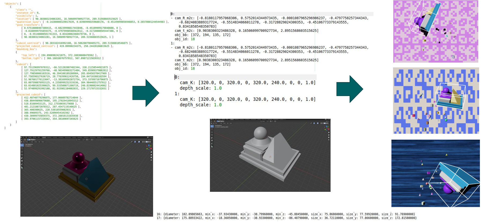

# Converting NDDS-Data to Preprocessed Linemod
This repository can be used to easily convert the data generated with [NDDS](https://github.com/NVIDIA/Dataset_Synthesizer) to [preprocessed Linemod](https://github.com/ybkscht/EfficientPose).




## Installing the code
* Use conda to install the code
```bash
conda create -n nddsConvertor python=3.6
conda activate nddsConvertor
pip install -r requirements.txt
```
## Using the code
This repository cotains 3 different tools, which all helps you to convert your data:

### 1 NDDS Images Groundtruth convertor
After generating RGB, Depth, Mask and Groundtruth data with NDDS. Use the following command to convert them:
```bash
python run.py --model-number 11 ndds --ndds-path datasets/test_dataset/NDDS_generated --save-path datasets/test_dataset/generated_dataset --train-percentage 0.9 --scale 1
```
args are:
* --model-number: The number you want your object to be saved. In Linemod every object has a uniq number
* --ndds-path: The Path where your NDDS data is saved under.
* --save-path: The Path you want to save your generated data.
  
optional args are:
* --train-percentage: The percentage amount of data used for training. (1-this amount) will be used for validation
* --scale: Since there are a lot of unit conversaion from CAD to NDDS and exporting it from there. 
  The scale is used to make the model scaled to the data. More in run.py.
  

### 2 Converted dataset viewer
After converting your data this tool can be used to see if the scale factor and the bounding boxes are correct.
```bash
python run.py --model-number 11 view --dataset-path datasets/test_dataset/generated_dataset --frame-number 1
```
args are:
* --model-number: The number you want your object to be saved. In Linemod every object has a uniq number
* --dataset-path: The Path to the generated dataset.
optional args are:
* --frame-number: The frame that you want to visualize the annotation.
* --save-path', The Path to store visualized images

### 3 .ply file point extractor
For reading the points from a .ply file and make the model/models_info.yml file.
```bash
python run.py --model-number 11 ply --ply-path datasets/test_dataset/generated_dataset/models/obj_11.ply --save-path datasets/test_dataset/generated_dataset/models
```
**Be aware that this only extracts the points from a .ply file and saves them under --save-path. 
models_info.yml must be created manually.**

args are:
* --model-number: The number you want your object to be saved. In Linemod every object has a uniq number
* --ply-path: Path to the .ply file
* --save-path', The path to save the obj.yml containing the points

